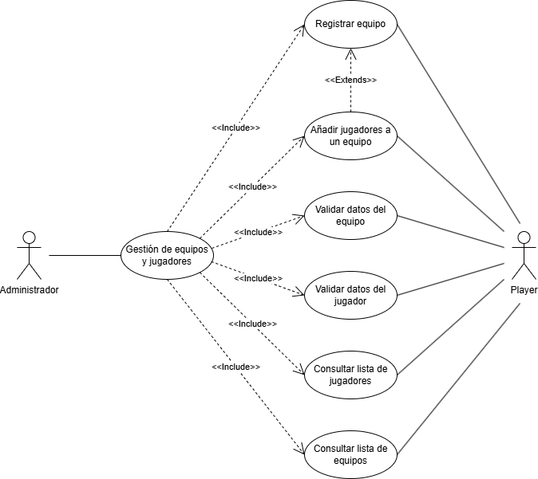
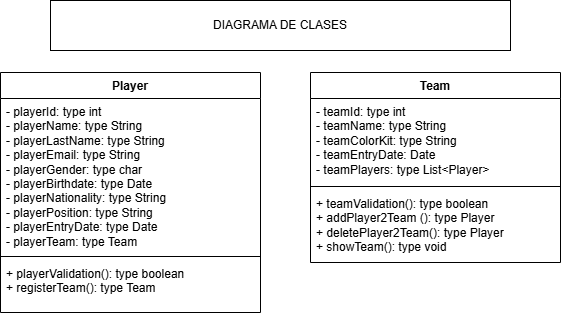

# Sistema de Gestión de Torneos de eSports

## Autor
David González Alcañiz

Perfil GitHub: David-Gonzalez-Alcañiz

## Descripción del Proyecto
Link al repositorio del proyecto: 
https://github.com/David-Gonzalez-Alcaniz/torneo-esports-uml.git

Este proyecto implementa un sistema de gestión de torneos de eSports
utilizando UML para el modelado y Java para la implementación.

## Diagramas UML
### Diagrama de Casos de Uso

### Diagrama de Clases

## Estructura del Proyecto
torneo-esports-uml/ ├── src/
│ ├── es/empresa/torneo/
│ │ ├── modelo/
│ │ ├── control/
│ │ ├── vista/
│ │ ├── Main.java
├── diagrams/
│ ├── casos-uso.png
│ ├── clases.png
├── README.md
├── .gitignore
├── LICENSE (opcional)

## Instalación y Ejecución
1. Clonar el repositorio:
`git clone git@github.com:David-Gonzalez-Alcaniz/torneo-esports-uml.git`

2. Compilar y ejecutar el proyecto:
`cd src javac es/empresa/torneo/Main.java java es.empresa.torneo.Main`

## Justificación del diseño
#### • ¿Quiénes son los actores que interactúan con el sistema?

En este caso, los actores serían:

* Actor 1: Administrador.
  
* Actor 2: Jugador.

#### • ¿Cuáles son las acciones que cada actor puede realizar?

Las acciones que puede realizar cada actor son:

* Actor 1 - Administrador: puede acceder a toda la gestion de equipos y jugadores (registrar equipo, añadir jugadores a un equipo, validar datos del jugador/equipo y consultar listas de jugadpres/equipos).

* Actor 2 - Jugador: en esta parte del proyecto, tiene el mismo acceso que el administrador, ya que este podrá registrar, validar y consultar jugadores/equipos.

#### • ¿Cómo se relacionan entre sí las entidades del sistema?

Las entidades se relacionan mediante acciones, que en este caso serían los casos de uso y métodos del programa. En el caso del admin, tendría un caso de uso mayor denominado "Gestión de equipos y jugadores" que incluiría todas las funciones pequeñas (compartidas a su vez por el jugador, ya que este puede realizarlas también).
El jugador, en caso de querer añadir jugador a un equipo y no haber equipos disponibles, extendería al caso de uso a registrar equipo para crear uno nuevo y así poder unirse.

#### Identifica las clases principales en función de los casos de uso seleccionados.

Clases: Jugadores y Equipos.

#### Distingue las clases de Entidad, Control e Interfaz para mantener una arquitectura modular.

...

#### Define atributos y métodos para cada clase.

 Atributos de Clase Jugador:
  
- playerId: type int
- playerName: type String
- playerLastName: type String
- playerEmail: type String
- playerGender: type char
- playerBirthdate: type Date
- playerNationality: type String
- playerPosition: type String
- playerEntryDate: type Date
- playerTeam: type Team

Atributos de la Clase Equipo:

- teamId: type int
- teamName: type String
- teamColorKit: type String
- teamEntryDate: Date
- teamPlayers: type List<Player>

Métodos de la Clase Jugador:

+ playerValidation(): type boolean
+ registerTeam(): type Team

Métodos de la Clase Equipo:

+ teamValidation(): type boolean
+ addPlayer2Team (): type Player
+ deletePlayer2Team(): type Player
+ showTeam(): type void

#### Establece relaciones entre clases, asegurando la correcta representación de asociaciones, agregaciones y composiciones.

En este caso, la relación entre jugadores y equipos sería de uno a muchos (en un equipo hay varios jugadores mientras que un jugador pertenece a un equipo).

## Conclusiones
En este proyecto, he aprendido nuevos conceptos, nuevos métodos y una nueva lógica (como si fuese el sistema).
Inicialmente fue complejo de entender, ya que tienes que cambiar la visión y pensar desde otro lugar. Una vez entendido, se hace ameno.
Me ha parecido muy interesante el diseño UML, ya que te permite una organización visual de lo que a futuro será el programa junto a sus clases, atributos, relaciones, dependencias, etc.

