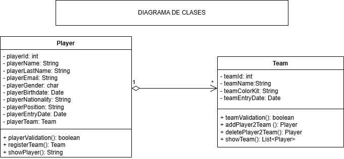

# Sistema de Gestión de Torneos de eSports

## Autor
David González Alcañiz

Perfil GitHub: David-Gonzalez-Alcañiz

## Descripción del Proyecto
Link al repositorio del proyecto: 
https://github.com/David-Gonzalez-Alcaniz/torneo-esports-uml.git

Este proyecto implementa un sistema de gestión de torneos de eSports
utilizando UML para el modelado y Java para la implementación.

## Diagramas UML
### Diagrama de Casos de Uso

### Diagrama de Clases

## Estructura del Proyecto
torneo-esports-uml/ ├── src/
│ ├── es/empresa/torneo/
│ │ ├── modelo/
│ │ ├── control/
│ │ ├── vista/
│ │ ├── Main.java
├── diagrams/
│ ├── casos-uso.png
│ ├── clases.png
├── README.md
├── .gitignore
├── LICENSE (opcional)

## Instalación y Ejecución
1. Clonar el repositorio:
`git clone git@github.com:David-Gonzalez-Alcaniz/torneo-esports-uml.git`

2. Compilar y ejecutar el proyecto:
`cd src javac es/empresa/torneo/Main.java java es.empresa.torneo.Main`

## Justificación del diseño
Por qué se eligió esa estructura y cómo se organizan las clases.

## Conclusiones
En este proyecto, he aprendido nuevos conceptos, nuevos métodos y una nueva lógica (como si fuese el sistema).
Inicialmente fue complejo de entender, ya que tienes que cambiar la visión y pensar desde otro lugar. Una vez entendido, se hace ameno.
Me ha parecido muy interesante el diseño UML, ya que te permite una organización visual de lo que a futuro será el programa junto a sus clases, atributos, relaciones, dependencias, etc.

